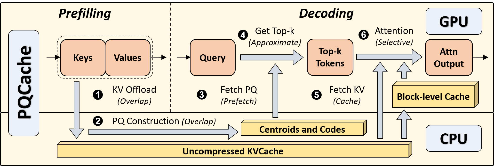

# [SIGMOD'25] PQCache: Product Quantization-based KVCache for Long Context LLM Inference ([Paper](https://arxiv.org/abs/2407.12820))

Codes for the SIGMOD 2025 paper "PQCache: Product Quantization-based KVCache for Long Context LLM Inference".


## Overview


As the field of Large Language Models (LLMs) continues to evolve, the context length in inference is steadily growing.
Key-Value Cache (KVCache), a crucial component in LLM inference, has now become the primary memory bottleneck due to limited GPU memory. 
Current methods selectively determine suitable keys and values for self-attention computation in LLMs to address the issue.
However, they either fall short in maintaining model quality or result in high serving latency.
Drawing inspiration from advanced embedding retrieval techniques used in the database community, we consider the storage and searching of KVCache as a typical embedding retrieval problem.
We propose **PQCache**, which employs Product Quantization (PQ) to manage KVCache, maintaining model quality while ensuring low serving latency.
During the prefilling phase, we apply PQ to tokens' keys for each LLM layer and head.
During the autoregressive decoding phase, for each newly generated token, we first identify important tokens through Maximum Inner-Product Search (MIPS) using PQ codes and centroids, then fetch the corresponding key-value pairs for self-attention computation.
Through meticulous design of overlapping and caching, we minimize any additional computation and communication overhead during both phases.
Extensive experiments show that PQCache achieves both effectiveness and efficiency. It maintains model quality even when only 1/5 of the tokens are involved in attention, while attaining acceptable system latency.



## Environment
Our python environment management is based on miniconda3. After installing miniconda3, execute commands below to setup.
```bash
conda create -n pqcache python=3.10
conda activate pqcache

pip install torch==2.1.2 --index-url https://download.pytorch.org/whl/cu121
# We install the "flash-attn" package from a downloaded wheel
wget https://github.com/Dao-AILab/flash-attention/releases/download/v2.5.8/flash_attn-2.5.8+cu122torch2.1cxx11abiFALSE-cp310-cp310-linux_x86_64.whl
pip install flash_attn-2.5.8+cu122torch2.1cxx11abiFALSE-cp310-cp310-linux_x86_64.whl
pip install -r requirements.txt
```
Current implementation of PQCache requires that the GPU's Compute Capability $\ge$ 80 (A100, A800, RTX4090, L40s, H100, H20, etc.) and the memory size $\ge$ 24G. We have tested and verified that PQCache can run on A800 and RTX4090.

## Models
Currently supported models include [meta-llama/Llama-3.1-8B-Instruct](https://huggingface.co/meta-llama/Llama-3.1-8B-Instruct) and [mistralai/Mistral-7B-Instruct-v0.2](https://huggingface.co/mistralai/Mistral-7B-Instruct-v0.2).

## Scripts

1. First compile lfucache for GPU cache:
```bash
cd vq_method/retrieval_based/lfu/
mkdir build; cd build; cmake ..; make
cd ../../../../
```

2. Then download the datasets of [LongBench](https://github.com/THUDM/LongBench) to `./data/`.
```bash
# You could simply use this link to download the data.
wget https://huggingface.co/datasets/zai-org/LongBench/resolve/main/data.zip
```
(Our experiment is based on LongBench v1)

4. [Optional] If you want to use local model checkpoints, please modify the paths listed in `config/model2path.json`.
```json
{
    "mistral-7b-Instruct-32k": "[MISTRAL_MODEL_PATH]",
    "llama-3.1": "[LLAMA_MODEL_PATH]"
}
```

4. Run the script:
```bash
bash run_llama.sh
```

5. Run the evaluation script after completing the generation of all samples:
```bash
python eval.py --model llama-3.1 --dataset narrativeqa --exp_name default
# python eval.py --model llama-3.1 --dataset [DATASET_NAMES,] --exp_name [EXP_NAME]
```
The evaluation results locate in `pred/llama-3.1/narrativeqa/default`(corresponding to the results in Table 2 of the paper).


You could also evaluate on multiple tasks by executing:
```bash
# For example, evaluate on [narrativeqa, qasper, trec].
python eval.py --model llama-3.1 --dataset narrativeqa qasper trec --exp_name default

# Gather the results of multiple tasks
python parse_result.py \
--model llama-3.1 \
--result_path pred \
--exp_name default \
--output_path default.json
```
## Code Structure

Our codes are mainly in the `vq_method` directory.
```
- retrieval_based
    - lfu: codes for GPU cache.
    - cache_manager.py: codes for cache management.
    - multi_core_compressor_v2.py: codes for multi-CPU-core compression.
    - pq_search.py: codes for PQ compressor.
- mistral_patch.py: codes for replacing the original attention in Mistral.
- llama31_patch.py: codes for replacing the original attention in Llama-3.1.
```


## Acknowledgement
During the development and implementation of PQCache, we learned a lot and borrowed some codes from the following projects.

[LongBench](https://github.com/THUDM/LongBench)  
[H2O](https://github.com/FMInference/H2O)  
[InfLLM](https://github.com/thunlp/InfLLM)  
[SPARQ](https://github.com/graphcore-research/llm-inference-research/tree/2024-01-paper)  
[Hetu](https://github.com/PKU-DAIR/Hetu)

## Citation
If you find this work useful, please cite [our paper](https://arxiv.org/abs/2407.12820).
